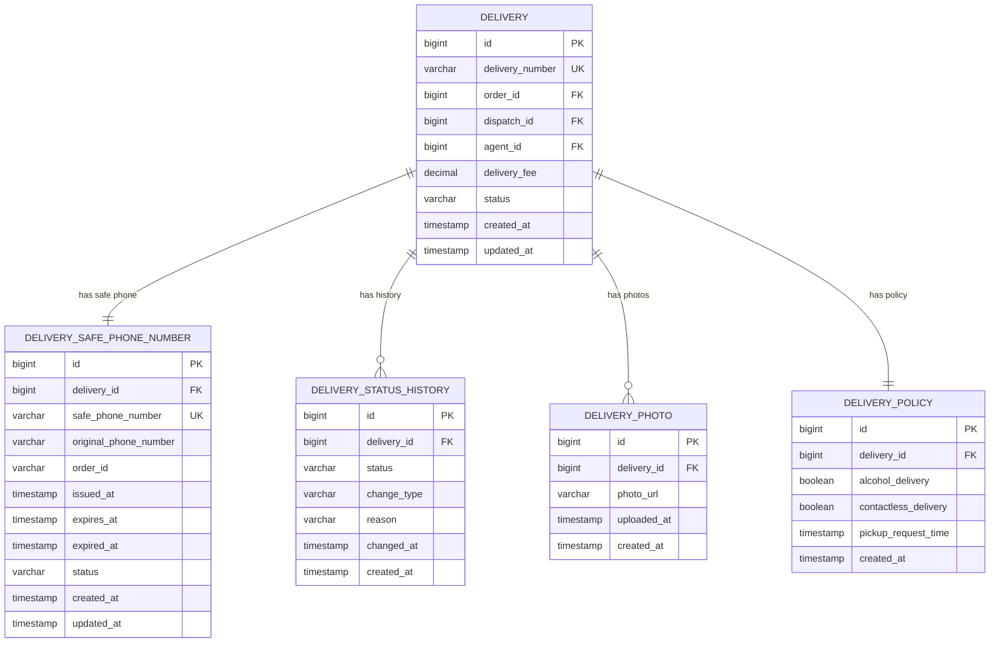

# 배송 시스템 ERD

## 개요
배송 시스템의 데이터베이스 설계 문서입니다.

## ERD 다이어그램



## 테이블 상세 설명

### 1. DELIVERY (배송)
- **목적**: 배송의 핵심 정보를 담는 메인 테이블
- **주요 필드**:
  - `delivery_number`: 배송 번호 (고유 식별자)
  - `order_id`: 주문 ID (외부 시스템 참조)
  - `dispatch_id`: 배차 ID (외부 시스템 참조)
  - `agent_id`: 기사 ID (외부 시스템 참조)
  - `delivery_fee`: 배송비
  - `status`: 배송 상태

### 2. DELIVERY_SAFE_PHONE_NUMBER (배송 안심번호)
- **목적**: 기사와 고객 간 안심번호 관리
- **주요 필드**:
  - `safe_phone_number`: 안심번호 (가상번호)
  - `original_phone_number`: 기사 실제 연락처
  - `status`: 안심번호 상태 (ACTIVE, EXPIRED, CANCELLED)
  - `issued_at`: 발급 시간
  - `expires_at`: 만료 예정 시간
  - `expired_at`: 실제 만료 시간

### 3. DELIVERY_STATUS_HISTORY (배송 상태 이력)
- **목적**: 배송 상태 변경 이력 추적
- **주요 필드**:
  - `status`: 해당 시점의 상태
  - `change_type`: 변경 유형 (PROGRESS, CANCELLATION, ROLLBACK)
  - `reason`: 변경 사유
  - `changed_at`: 상태 변경 시간

### 4. DELIVERY_PHOTO (배송 사진)
- **목적**: 비대면 배송 시 필수 사진 관리
- **주요 필드**:
  - `photo_url`: 사진 URL
  - `uploaded_at`: 업로드 시간

### 5. DELIVERY_POLICY (배송 정책)
- **목적**: 주문 서버에서 가져온 배송 정책 정보
- **주요 필드**:
  - `alcohol_delivery`: 주류 배송 여부
  - `contactless_delivery`: 비대면 배송 여부
  - `pickup_request_time`: 픽업 요청 시간

## 상태 정의

### 배송 상태 (DELIVERY.status)
- `STARTED`: 배송 시작
- `ARRIVED`: 상점 도착
- `PICKED_UP`: 픽업 완료
- `COMPLETED`: 배송 완료
- `CANCELLED`: 배송 취소

### 안심번호 상태 (DELIVERY_SAFE_PHONE_NUMBER.status)
- `ACTIVE`: 활성 (발급됨, 만료 전)
- `EXPIRED`: 만료됨
- `CANCELLED`: 취소됨

### 상태 변경 유형 (DELIVERY_STATUS_HISTORY.change_type)
- `PROGRESS`: 정상 진행
- `CANCELLATION`: 취소
- `ROLLBACK`: 이전 상태로 되돌림

## 비즈니스 규칙

1. **안심번호 생성**: 배송 생성 시 기사 서버 호출하여 실제 연락처 조회 후 안심번호 생성
2. **취소 가능 시점**: 픽업 전까지만 취소 가능
3. **비대면 배송**: 배송 완료 시 사진 업로드 필수
4. **상태 이력**: 모든 상태 변경을 이력으로 추적
5. **안심번호 만료**: 배송 완료 또는 시간 만료 시 안심번호 비활성화

## 상태 전이 흐름

```
정상 진행:
STARTED → ARRIVED → PICKED_UP → COMPLETED

취소:
STARTED → CANCELLED
ARRIVED → CANCELLED
PICKED_UP → CANCELLED (픽업 후에는 취소 불가)
```

## 연락처 정보 흐름

```
1. 배송 생성 시:
   - 기사 서버 호출 → 실제 연락처 조회
   - 안심번호 생성 → DELIVERY_SAFE_PHONE_NUMBER에 저장

2. 연락처 조회 시:
   - DELIVERY_SAFE_PHONE_NUMBER에서 safe_phone_number 조회
   - original_phone_number는 보안상 접근 제한
```

## 안심번호 생명주기

```
1. 배송 생성 시:
   - safe_phone_number: "010-1234-5678" (가상번호)
   - original_phone_number: "010-9876-5432" (실제 기사 번호)
   - status: "ACTIVE"
   - issued_at: 2025-01-12 10:00:00
   - expires_at: 2025-01-12 22:00:00 (12시간 후)

2. 배송 완료 시:
   - status: "CANCELLED"
   - expired_at: 2025-01-12 11:30:00

3. 시간 만료 시:
   - status: "EXPIRED" 
   - expired_at: 2025-01-12 22:00:00
```
